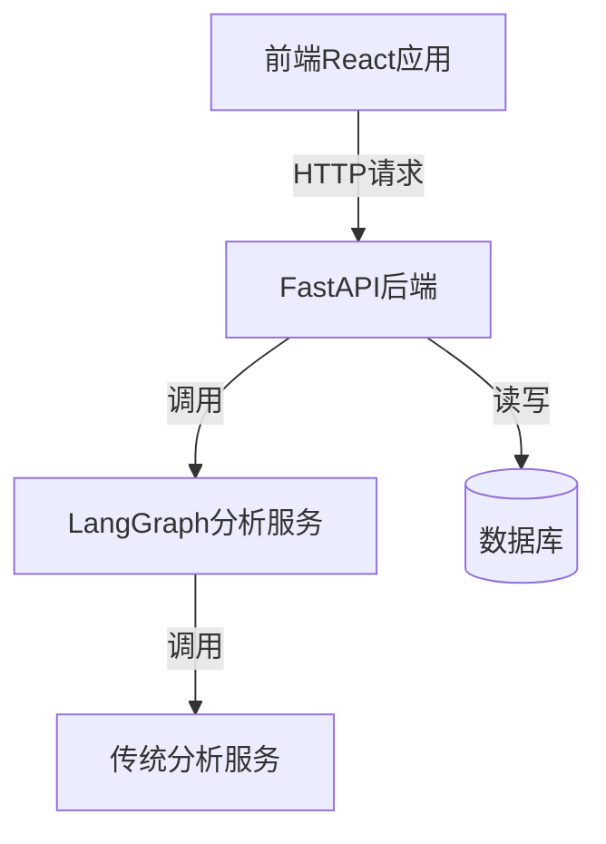

# 食物营养分析系统架构说明

## 系统概述
本系统是一个基于React前端和FastAPI后端的食物营养分析应用，使用LangGraph构建分析流程。

## 系统架构


## 核心流程
1. 图片上传与分析：
   - 前端调用`/sessions`创建新会话
   - 上传图片到`/sessions/{session_id}/upload-image`
   - 后端分析图片并返回热量数据

2. 减肥状态问答：
   - 前端显示热量分析结果
   - 询问用户是否在减肥
   - 提交回答到`/sessions/{session_id}/diet-response`

3. 生成建议：
   - 后端根据减肥状态生成个性化建议
   - 创建与西兰花的营养对比表格
   - 返回完整分析结果

4. 历史记录查询：
   - 前端调用`/history`接口
   - 后端返回用户完整的历史分析记录

## 关键API接口
### POST /sessions
- 功能：创建新会话
- 响应：
  ```json
  {
    "session_id": "uuid",
    "created_at": "2025-08-19T07:00:00"
  }
  ```

### POST /sessions/{session_id}/upload-image
- 功能：上传并分析食物图片
- 请求：multipart/form-data格式的图片文件
- 响应：
  ```json
  {
    "calories": 350,
    "food_type": "汉堡",
    "next_step": "diet_question"
  }
  ```

### POST /sessions/{session_id}/diet-response
- 功能：处理减肥状态回答
- 请求：
  ```json
  {
    "is_dieting": true
  }
  ```
- 响应：
  ```json
  {
    "recommendation": "当前食物热量(350kcal)较高，建议减少摄入量并搭配西兰花",
    "comparison_table": {
      "food": "汉堡",
      "calories": 350,
      "broccoli_equivalent": 2.5,
      "nutrient_density": "低"
    }
  }
  ```

### GET /history
- 功能：获取历史分析记录
- 响应：
  ```json
  [
    {
      "id": 1,
      "image_path": "/static/uploads/xxx.jpg",
      "calories": 350,
      "created_at": "2025-08-19T06:51:49"
    }
  ]
  ```

## LangGraph服务
包含三个主要流程：
1. 图片分析流程：
   - 图片预处理 → 食物识别 → 热量估算

2. 营养对比流程：
   - 热量分析 → 与西兰花营养对比 → 生成对比表格

3. 个性化建议流程：
   - 根据减肥状态 → 生成个性化饮食建议